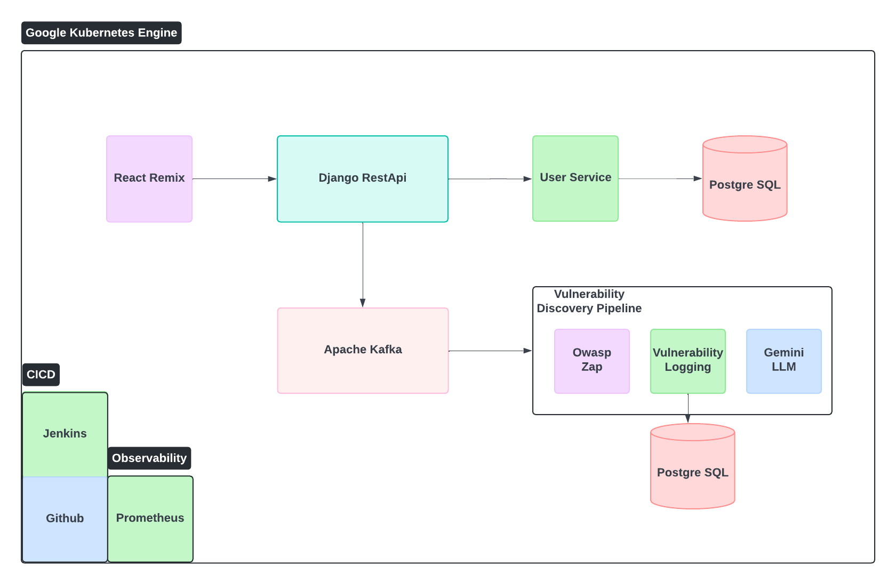

# Gun n' Powder

an Automated AI-Enhanced Penetration Testing Platform

# Problem Statement:

Build an AI-driven penetration testing platform that automates the simulation of cyber-attacks to identify system vulnerabilities in real time.

## Persona:

Tom is a junior cybersecurity analyst and he has been tasked with finding vulnerabilities. Tom is familiar with some of the vulnerabilities but he doesn't know how to initiate scanning to look for them. He would like something that can simplify the process of finding vulerabilities. The tool is designed to integrate AI with penetration testing of this vulnerability.

## Architecture Diagram

 

## Technology:

- Frontend: React
- Backend: Django Rest API
- Databse: Postgre SQL
- CICD: Github Action
- AI LLM: Gemini
- Vulnerability Scanner: OWASP ZAP

## Running In Development
- cd into frontend
- run `npm run dev`
